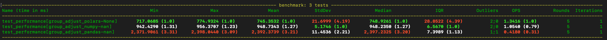

# group-adjust

Demeaning a series with multiple labels per entry

# Installation

Navigate to the parent directory of this repository and run:

```bash
git clone https://github.com/jibasham/group-adjust.git .
cd group-adjust
python -m venv venv
source venv/bin/activate
pip install .
```

# The Problem

```
Your task is to implement the 'group_adjust' method as described
below, ensuring that all provided unit tests pass. Your solution
can be pure Python, NumPy, Pandas, or any combination of the three.
There are multiple ways of solving this problem, so feel free to be
creative, but please include comments to explain your code. Bonus
points are given for particularly efficient (fast) implementations!

Group Adjust Method
The algorithm needs to do the following:
1.) For each group-list provided, calculate the means of the values for each
unique group.

  For example:
  vals       = [  1  ,   2  ,   3  ]
  ctry_grp   = ['USA', 'USA', 'USA']
  state_grp  = ['MA' , 'MA' ,  'CT' ]

  There is only 1 country in the ctry_grp list.  So to get the means:
    USA_mean == mean(vals) == 2
    ctry_means = [2, 2, 2]
  There are 2 states, so to get the means for each state:
    MA_mean == mean(vals[0], vals[1]) == 1.5
    CT_mean == mean(vals[2]) == 3
    state_means = [1.5, 1.5, 3]

2.) Using the weights, calculate a weighted average of those group means
  Continuing from our example:
  weights = [.35, .65]
  35% weighted on country, 65% weighted on state
  ctry_means  = [2  , 2  , 2]
  state_means = [1.5, 1.5, 3]
  weighted_means = [2*.35 + .65*1.5, 2*.35 + .65*1.5, 2*.35 + .65*3]

3.) Subtract the weighted average group means from each original value
  Continuing from our example:
  val[0] = 1
  ctry[0] = 'USA' --> 'USA' mean == 2, ctry weight = .35
  state[0] = 'MA' --> 'MA'  mean == 1.5, state weight = .65
  weighted_mean = 2*.35 + .65*1.5 = 1.675
  demeaned = 1 - 1.675 = -0.675
  Do this for all values in the original list.

4.) Return the demeaned values

Hint: See the test cases below for how the calculation should work.
```

# Initial Thoughts to The Prompt

So, we will be computing a weighted average. A good bread and butter data analysis task. The
problem suggests three possible choices for tools: pure python, numpy, and pandas. It also notes
that bonus points will be awarded for a fast solution. So my take on this question is that it can
be used to bin people into three categories:

1. *Do you speak python at all?* Ones who do something unwieldy but manage to make it work.
   Probably the pure python route.
   These would be people that maybe know a little bit of python but not the numeric libraries.
2. *Do you have 1-2 years of experience with Data Science?*: Ones who have used pandas before
   but maybe do something a little inefficient, like use of `iterrows` instead of `map`.
3. *But do you __really__ know what you're doing?* These ones get the bonus points! This requires some
   familiarity with which operations are
   fast and slow. And the other tools around testing and benchmarking to prove to yourself its fast.
   To be honest, if I were you I would only be interested in this category.

So I will be aiming for bonus points 😁

A good solution should probably be about 10 lines of code, so let's try a few of them and see how
they stack up.

# Some Assumptions

- Whatever data we have will fit in memory. Certainly there are plenty of applications where this
  is not true. In these cases we would use some database or use a solution where you can operate on
  files, such as polars.
- The number of groups is small. If it gets to be on the order of the number of values, you might see some solutions
  that look like O(N) becoming O(N<sup>2</sup>).
- Fast is more important than low memory usage.
- Null values are present, but they are not that common. If we were dealing with very sparse data,
  we would consider something that natively handles sparse data. Of the three tools we look at, I
  believe only pandas has a good sparse data structure. I'm sure polars will get one in the next
  couple years.

# Solutions

See the [`group_adjust.py`](src/group_adjust.py) file for the implementations.

## Pure Python

I will not be writing a pure python solution. This one I think is offered up as a trap. A pure
python solution would be a little awkward, and would not make use of any vectorized operations,
so it would be the slowest by probably a very wide margin. I would guess 100x slower, maybe 10x
for something extremely clever.

## Pandas

Pandas of course is the go-to. Everyone knows it since most data science examples
use it. It's pretty fast. If I am writing for an established codebase, I would
most likely use Pandas unless there was a good reason not to. It will be more maintainable
and quicker for others to adopt. Let's be honest, as cool as it is to write efficient code,
for about 90% of the time it is not worth it. You can always throw more hardware at the problem.
Software engineers are expensive, and having to learn a new tool is a big time sink if the
problem is of the ordinary variety. So pandas is a good default choice because you can show someone the
solution and they will understand it quickly.

This is the first thing I attempted and what I would call the "vanilla" solution.
Essentially group by all the unique labels to get the means. It is pretty
straight-forward to code up, and reasonably fast, although the extra overhead for
the convenient syntax would slow you down over a pure NumPy solution, since its
numpy under the hood anyway.

Of course, we stick to vectorized operations and avoid the temptation to use any iterators because
they are painfully slow.

I am getting 2.4 s wall clock and 540 MB memory utilization for the "benchmark"
test with 20M elements in the DataFrame. I am a little sad the memory usage
is so high - I did try to play some tricks to use categorical data types and
throw away the intermediate values as I accumulate the weighted means.

See [`group_adjust.py Line 70`](src/group_adjust.py)for the implementations.

## NumPy

To be honest this is faster than I expected. I initially avoided it because I
could not think of a way to get around for loops, and if there are a lot of groups
it could get bogged down. But let's assume the number of groups is small, as in the
test cases, in which case the overhead is small.

We can achieve similar functionality to groupby using `mask` and `unique` in numpy.

I am getting 942 ms wall clock time
and 310 MB memory utilization for the "benchmark" test with 20M elements.

See [`group_adjust.py Line 199`](src/group_adjust.py)for the implementations.

## Polars

Polars is generally more efficient than Pandas, as it tries to use more CPU cores
and has other optimizations under the hood to reshuffle the order of lazy operations
and reduce memory usage. Since we are going for speed here, I thought I would give
it a go and compare to pandas. I am getting 717 ms wall clock and 250 MB memory
utilization for the "benchmark" test with 20M elements in the DataFrame.

The implementation here is pretty much the same as for pandas (which I did first),
but now as a fairly recognizable transcription into polars syntax. I am storing
the intermediate values in the DataFrame, which is not necessary, but it does oddly
make it a bit faster than using a throwaway Series to store the weighted means
(as I do in the pandas version). And I am assuming faster is more important than
using a little extra memory.

See [`group_adjust.py Line 134`](src/group_adjust.py)for the implementations.

# Benchmarking

_To run yourself simply run `pytest` from the root directory of this repository._

_Benchmarks are done on a MacBook M2 with 12 cores / 16 GB RAM._

The results are pretty much what I expected. The pandas solution, while it looks nice and clean, is the slowest and
uses the most memory. The numpy solution is actually faster than I thought, although I do expect it would slow down
if you had a lot of unique groups, due to the nested for loops. Polars takes the win here. Its definitely the fastest,
although the code is a bit harder to read than the pandas solution.



We see the same trend for memory utilization as we do for speed

### Memory Utilization

| Library | Memory Usage |
|---------|--------------|
| Polars  | 250 MB       |
| Numpy   | 310 MB       |
| Pandas  | 540 MB       |
